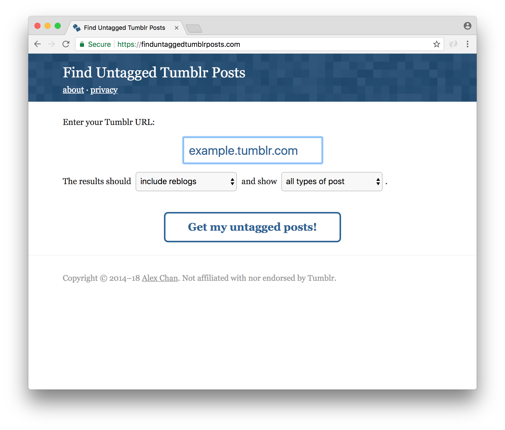

# finduntaggedtumblrposts.com

This repo contains the source code for [finduntaggedtumblrposts.com][root], which helps you find untagged posts on Tumblr.



[root]: https://finduntaggedtumblrposts.com
[jekyll]: https://jekyllrb.com/

## Motivation

The idea for this site started in 2013, when a friend was trying to go back and retag her old Tumblr posts.
Without a way to easily see all her untagged posts, it was impossible for her to be sure that she was done.
I wrote her <a href="https://alexwlchan.net/2013/08/untagged-tumblr-posts/">a Python script</a> to get the job done, and that was that.

In 2014, I was getting a lot of hits to that post, but a Python script isn’t very user friendly.
I wrote this site to be an easier way to get a list of your untagged posts, because clearly it was something people wanted.

All the source code is [on GitHub](https://github.com/alexwlchan/untagged-tumblr-posts), and released under the [MIT license](https://opensource.org/licenses/MIT).

## Building the site

The site is written as a single HTML file, plus a bit of JavaScript and CSS.

The original HTML is in the root of the repo; to minify it before pushing I run the command:

```console
$ htmlmin index.html site/index.html
```

using the [htmlmin library](https://pypi.org/project/htmlmin/).

## Deploying the site

The site is deployed to Netlify by pushing to `main`.
